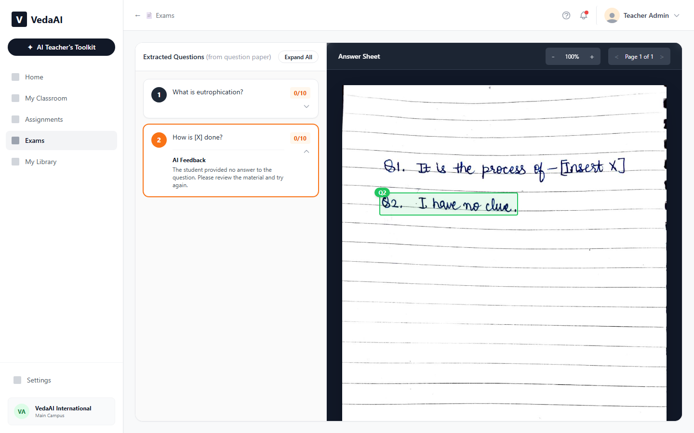

# VedaAI — Assessment Extraction & Answer Mapping

Upload a question paper and a student's handwritten answer sheet. The app extracts every question, extracts every answer, matches them up, and highlights exactly where on the scan each answer lives — then grades the whole thing.

**Live app:** https://ai-assessment-extraction-applicatio.vercel.app
**Repo:** https://github.com/Armaan-94/ai_assessment_extraction_application



## How it works

```
Question Paper ──┐
                  ├─▶ Extract Questions ─▶ Extract Answers ─▶ Map Answers ─▶ Grade
Answer Sheet   ───┘
```

1. **Upload** — a question paper and an answer sheet, PDF or image, client-side (no upload endpoint, files never leave the browser except as images sent to the model).
2. **Extract Questions** — every question is pulled out in printed order, with labeled sub-parts (`11(a)`, `11(b)`) kept as separate entries and original numbering preserved.
3. **Extract Answers** — the answer sheet is read page by page; each handwritten answer is matched to a question by its written label (not by position, so out-of-order answers still map correctly) and located with a bounding box.
4. **Map & Highlight** — click any question and the exact region of the answer sheet lights up. Answers spanning multiple pages surface a "continues on page N" jump. Unanswered questions and answers that don't match any question are both called out explicitly rather than silently dropped.
5. **Grade** — each answer is scored against its question with a short AI feedback note, and the panel adds up a running total.

## Stack

- **Next.js 14** (App Router) + React 18 + Tailwind CSS
- **pdf.js** (`pdfjs-dist`) for client-side PDF → image rendering
- **Gemini** (`gemini-flash-lite-latest`) for extraction, grounding, and grading, via the `@google/generative-ai` SDK, with structured JSON output enforced through response schemas
- No database, no auth — everything lives in React state for the session, exactly as the brief asks for

## Running locally

```bash
npm install
```

Create `.env.local`:

```
GEMINI_API_KEY=your_key_here
```

Get a free-tier key at [aistudio.google.com/apikey](https://aistudio.google.com/apikey).

```bash
npm run dev
```

Open [http://localhost:3000](http://localhost:3000).

## Design notes & assumptions

- **Matching is id-based, not position-based.** Answer extraction is handed the full question list up front and matches each written answer to a question id, so answers out of order or answers referencing an earlier/later question both resolve correctly.
- **"Unmatched" is validated, not trusted.** Rather than trusting the model to return an empty id for a stray answer, the id is checked against the actual known question list — this catches cases where the model echoes back words like "unmatched" instead of leaving the field empty.
- **One question paper, one answer sheet, per session.** Multi-student batch grading is out of scope for this pass.
- **Bounding-box grounding is inherently approximate.** It's driven by the vision model's own spatial understanding of the page image, so accuracy depends on handwriting legibility and layout density — cleaner handwriting and more whitespace between answers ground more reliably.
- **Free-tier rate limits.** Grading is done sequentially with a short delay between calls to stay under the Gemini free-tier request rate; a large answer sheet will grade proportionally slower.
- **Failures are recoverable, not fatal.** A failed extraction shows a dismissible in-app banner with a Retry button instead of a blocking alert, and keeps your uploaded files in place — no re-upload needed. If grading fails independently (e.g. a rate-limit blip) after mapping already succeeded, the results page still loads and offers a "Retry Grading" action on just that step.

## Known limitations

- No persistence — refreshing the results page loses the session (by design, per the "no database" constraint).
- No batch/multi-student flow yet.
- Very long answer sheets (many pages) will take proportionally longer end-to-end since pages are processed sequentially.
